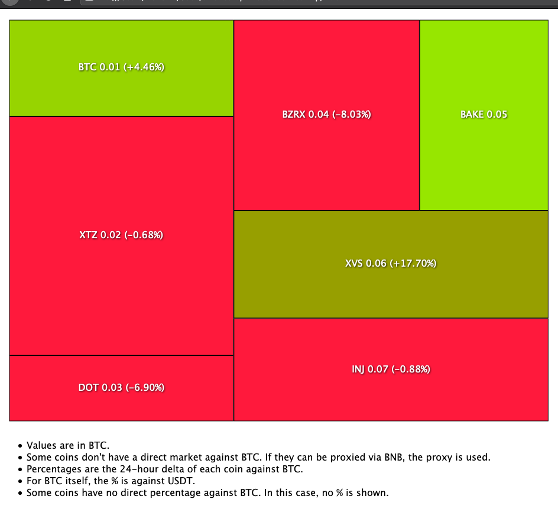

# binance-spot-balance-treemap
A D3 treemap chart visualisation for a Binance Spot Balance.



# Installation

This Python project is managed using `poetry`:

```bash
$ poetry install
```

But you can choose to manage it yourself. The only dependency is `python-binance`:

```bash
$ pip install python-binance
```

In order to show your balance, it needs a READ-ONLY!! API key and secret from your binance account. Supply it via environment variables. Execute like this:

```bash
$ BINANCE_RO_API_KEY=$BINANCE_RO_API_KEY BINANCE_RO_SECRET=$BINANCE_RO_SECRET poetry run python balance.py
```

If you're not using `poetry`:

```bash
$ BINANCE_RO_API_KEY=$BINANCE_RO_API_KEY BINANCE_RO_SECRET=$BINANCE_RO_SECRET python balance.py
```

This returns the contents of a js file that `index.html` will import. It looks like this:

```javascript
var data =
[{"name": "Origin", "parent": "", "value": null, "percent": null}, {"name": "BTC", "parent": "Origin", "value": 0.01, "percent": 4.719}, {"name": "XTZ", "parent": "Origin", "value": 0.02, "percent": -1.845}, {"name": "DOT", "parent": "Origin", "value": 0.03, "percent": -7.25}, {"name": "BZRX", "parent": "Origin", "value": 0.04, "percent": -8.115}, {"name": "BAKE", "parent": "Origin", "value": 0.05, "percent": 0}, {"name": "XVS", "parent": "Origin", "value": 0.06, "percent": 22.826}, {"name": "INJ", "parent": "Origin", "value": 0.06, "percent": -0.176}]
```

Then, if you save that into `data.js`, you should be able to open `index.html` and see the treemap. Here's a one-liner to do all that:

```bash
$ BINANCE_RO_API_KEY=$BINANCE_RO_API_KEY BINANCE_RO_SECRET=$BINANCE_RO_SECRET poetry run python balance.py > data.js && open index.html
```
